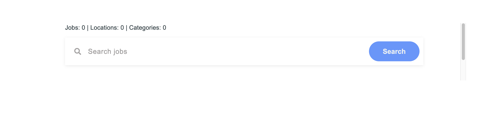
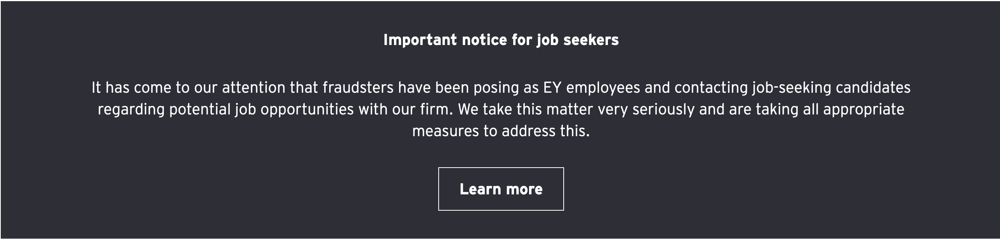
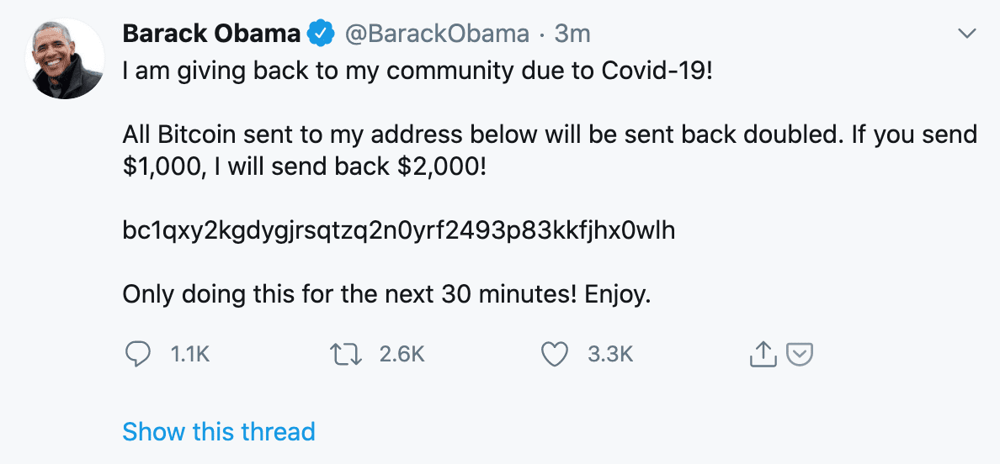

<!-- .slide: data-auto-animate -->
#### THE CYBER SECURITY RISKS ON SOCIAL MEDIA

----

<!-- .slide: data-auto-animate -->

    <h4> THE CYBER SECURITY RISKS ON SOCIAL MEDIA </h4>

- Prajwol Pradhan (076BEI023)
- Krishbin Paudel (076BEI018)
- Asmin Silwal (076BEI040)
- Bibek Pariyar (076BEI012)

---

### Introduction

---

### Case study: LinkedIn

----

#### Recruitment scam/fraud

----

Disclaimer: No intention to harm or damage reputation of any company. These examples are picked just to demonstrate the current scenario in scam/fraud, and, thus, as a way to spread awareness.

----

My search term: "ey hiring"

https://www.linkedin.com/search/results/content/?keywords=ey+hiring

Company on spotlight: EY (a company which provides consulting, assurance, tax and transaction services)

----

Sample post #1:

----

Sample post #2:

----

Comments:

----

----

Let's check the forms

----

----

----

Sample post #3:

<!-- .slide: data-auto-animate -->

----

<!-- .slide: data-auto-animate -->

Spot the red flag

----

What was your "Last Drawn Salary"?

----

<!-- .slide: data-auto-animate -->
#### Motives

<!-- ---- -->

<!-- .slide: data-auto-animate -->
<!-- #### Motives -->

----

<!-- .slide: data-auto-animate -->
> If interested comment #interested.

----

<!-- .slide: data-auto-animate -->
> If interested comment #interested.

- "I want to increase engagement on my post/s"

----

<!-- .slide: data-auto-animate -->
> "Send Connection so that we can review your profile matches"

That is:

"Send me connection request so that we can review whether your profile matches"

----

<!-- .slide: data-auto-animate -->
> "Send Connection so that we can review your profile matches"

- "I want to flaunt my connections count and my followers count"
- "I want to increase engagement on my post/s"

----

<!-- .slide: data-auto-animate -->
> Tell us about your "Last Drawn Salary"

----

<!-- .slide: data-auto-animate -->
> Tell us about your "Last Drawn Salary"

- "I want to know whether I should invest my time to scam you"

----

<!-- .slide: data-auto-animate -->
> Fill this Google Form

----

<!-- .slide: data-auto-animate -->
> Fill this Google Form

- "I want to harvest as much information about you as I can, so that I can scam you better"

----

#### Tips to avoid being scammed

----

1. Verify whether the job posting is legit

----

Check official jobs/careers page of the company for open roles

Source: https://uxcam.com/careers/

----

Companies might have published notice like this

Source: https://www.ey.com/en_us/careers

----

Ask the officials of the company to verify the information

Source: https://uxcam.com/careers/ 

----

Look for red flags like we discussed

----

2. Avoid giving out your personal information to strangers

- Do not fill out random forms that ask for your personal information or PII
<!-- .element: class="fragment" -->
- Read point #1 again
<!-- .element: class="fragment" -->

----

3. Understand that legit recruiters do not ask you to:

- comment #interested, or
<!-- .element: class="fragment" -->
- send them connection request so that they can check your profile, or
<!-- .element: class="fragment" -->
- follow them on xyz social media, or
<!-- .element: class="fragment" -->
- contact them on xyz platform, or
<!-- .element: class="fragment" -->
- send them money for anything, or
<!-- .element: class="fragment" -->
- do anything that sounds suspicious, really
<!-- .element: class="fragment" -->

----

    
    
 Multiple RED flags! 🚩🚩 

----

4. Report suspicious posts and people!

Whether or not it is LinkedIn, just report them!
<!-- .element: class="fragment" -->

----

Report to:
- the respective social media platform
- the company being used for scamming
- law-enforcement agencies (e.g. police, government reporting portals, etc.)

----

Some resources (not limited to LinkedIn):

- Vetro Recruitment (LinkedIn) - [Recruitment Scams: How to Spot, Avoid, and Report](https://www.linkedin.com/pulse/recruitment-scams-how-spot-avoid-report-vetro-recruitment/)

- Muhammad Imran Khan (LinkedIn) [Job Scams in LinkedIn Posts: How to Spot and Avoid Them](https://www.linkedin.com/pulse/job-scams-linkedin-posts-how-spot-avoid-them-muhammad-imran-khan-/)

----

- Bethany Biron (Business Insider) - [Scammers are posing as fake recruiters, conducting staged interviews - and hiring - as part of an ID theft scheme. Here's how to avoid getting swindled.](https://www.businessinsider.com/how-to-avoid-scammers-posing-job-recruiters-id-theft-2022-8)

- Erin Booth (YouTube) - [Avoiding Job Scams on LinkedIn | 11 Signs that It's a Scam](https://www.youtube.com/watch?v=EDpitwOLo8E)

----

- NitMan Talks (YouTube) - [BEWARE Of These Fake Job Posts On LINKEDIN | How To Identify Fake LinkedIn Job Posting?](https://www.youtube.com/watch?v=cBt9-E4r_lM)

- Forbes India (YouTube) - [PART-TIME JOB SCAM: Beware of growing WhatsApp and Telegram fraud](https://www.youtube.com/watch?v=9P8YxsDwX_c)

---

### Case Study: Facebook
----

### Collection of User Data
 - Social media platforms often collect and store large amounts of user data.
 - This data can be used for targeted advertising and other purposes.
 - As per the privacy policies of company, the data can be shared with third parties.
 - The user data should be anonymized and aggregated to protect the privacy of the users.

----

#### What does Facebook know about you?
 Facebook collects a wide range of data about its users.
   - Personal information
    - Location data
    - Browsing history
    - Device information
    - Contact information
    - Messages and calls

----

#### Your data may already be compromised
 - Social media platforms are not immune to bugs and vulnerabilities, which can be exploited.
 - Users should be cautious about the apps they use and keep their devices up to date with the latest security patches.
 - Reporting any suspicious activity to the platform's security team can help prevent further exploitation of vulnerabilities.

----

#### Social Media Platforms may share your data with third parties
 - Social media platforms often collect and store large amounts of user data, which can be used for targeted advertising and other purposes.
 - Users should be aware of the privacy policies of the platforms they use and take steps to limit the amount of personal information they share.
 - Privacy settings should be reviewed regularly to ensure that they are set to the user's preferences.

----
### Cambridge Analytica Scandal
- In 2018, it was revealed that the political consulting firm Cambridge Analytica had harvested the personal data of millions of Facebook users without their consent.
- The data was used to create targeted political advertising during the 2016 US presidential election.
- The scandal raised concerns about the privacy and security of user data on social media platforms.

----

### Fake Profiles
 - Social media platforms are often used to create fake profiles, which can be used for various purposes, including identity theft, fraud, and harassment.
 - Users should be cautious about the information they share on social media and take steps to protect their accounts.
 - Reporting fake profiles to the platform's security team can help prevent further exploitation of vulnerabilities.
---
### Case Study: Twitter
----
### A place for realtime facts
- Twitter is a platform where people can share their thoughts and opinions in real time.
- It is also a place where misinformation and disinformation can spread quickly.
- Users should be cautious about the information they share and verify the accuracy of the information they receive.

----
### Verify the Source
- Ensure that data is coming from a reliable source.
- Check the credibility of the source before sharing the information.
- Misinformation can spread quickly on Twitter, so it is important to verify the accuracy of the information before sharing it.

----

### Fake Posts from a Verified Account
- In 2020, the Twitter accounts of several high-profile individuals and organizations were hacked, and fake posts were made from their accounts.
- The posts were used to promote a cryptocurrency scam, which raised concerns about the security of verified accounts on Twitter.
- Users should be cautious about the information they receive from verified accounts and take steps to verify the authenticity of the posts.

----

----

### How can we mitigate the risks?
- Users should follow company blogs and news to stay updated about the latest security features and updates.
- Users should be cautious about the information they share on social media and take steps to protect their accounts.
- Reporting any suspicious activity to the platform's security team can help prevent further exploitation of vulnerabilities.

---

Thank You!

And comment #interested.