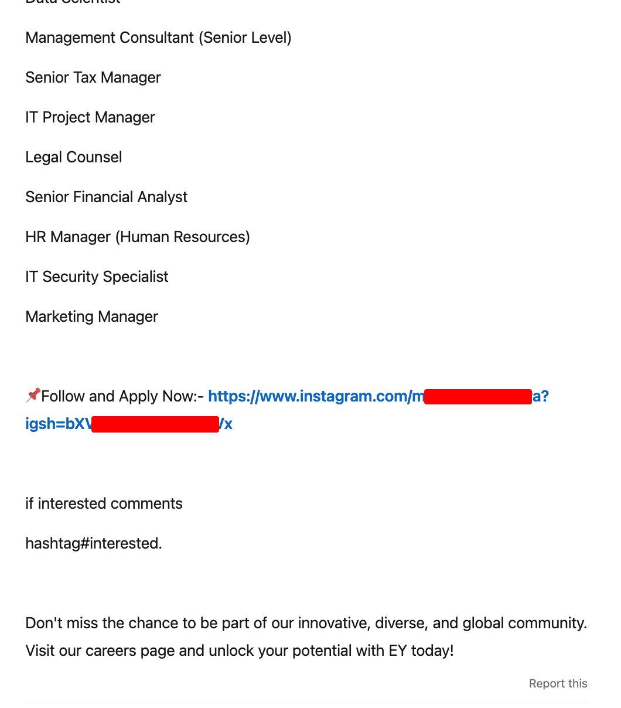

<!-- .slide: data-auto-animate -->
### THE CYBERSECURITY RISKS ON SOCIAL MEDIA

----

<!-- .slide: data-auto-animate -->
### THE CYBERSECURITY RISKS ON SOCIAL MEDIA

<ul>
<li style="color: #c0c0c0;"> Bibek Pariyar (076BEI012) </li>
<li style="color: #c0c0c0;"> Krishbin Paudel (076BEI018) </li>
<li> Lincoln Basnet (076BEI020) </li>
<li> Prajwol Pradhan (076BEI023) </li>
<li> Samir Chapagain (076BEI034) </li>
<li> Asmin Silwal (076BEI040) </li>
</ul>

---

## Introduction

---

## Case study: LinkedIn
(Bonus: WhatsApp)

----

### Recruitment scam/fraud

----

**Disclaimer**

No intention to harm or damage reputation of any company. These examples are picked just to demonstrate the current scenario in scam/fraud, and, thus, as a way to spread awareness.

----

My search term: "ey hiring"

https://www.linkedin.com/search/results/content/?keywords=ey+hiring

Company/s on spotlight:
- EY (a company which provides consulting, assurance, tax and transaction services)
- UXCam

----

Sample post #1:

----

Sample post #2:

----

Comments:

----

----

#### Let's check the forms

----

----

----

Sample post #3:

<!-- .slide: data-auto-animate -->

----

<!-- .slide: data-auto-animate -->

Spot the red flag

----

What was your "Last Drawn Salary"?

----

<!-- .slide: data-auto-animate -->
### Motives

<!-- ---- -->

<!-- .slide: data-auto-animate -->
<!-- #### Motives -->

----

<!-- .slide: data-auto-animate -->
> If interested comment #interested.

----

<!-- .slide: data-auto-animate -->
> If interested comment #interested.

- "I want to increase engagement on my post/s"

----

<!-- .slide: data-auto-animate -->
> "Send Connection so that we can review your profile matches"

That is:

"Send me connection request so that we can review whether your profile matches"

----

<!-- .slide: data-auto-animate -->
> "Send Connection so that we can review your profile matches"

- "I want to flaunt my connections count and my followers count"
- "I want to increase engagement on my post/s"

----

<!-- .slide: data-auto-animate -->
> Tell us about your "Last Drawn Salary"

----

<!-- .slide: data-auto-animate -->
> Tell us about your "Last Drawn Salary"

- "I want to know whether I should invest my time to scam you"

----

<!-- .slide: data-auto-animate -->
> Fill this Google Form

----

<!-- .slide: data-auto-animate -->
> Fill this Google Form

- "I want to harvest as much information about you as I can, so that I can scam you better"

---

**Let's look at the other side: WhatsApp**

----

----

---

### Tips to avoid being scammed

----

1. Verify whether the job posting is legit

----

Check official jobs/careers page of the company for open roles

Source: https://uxcam.com/careers/

----

Companies might have published notice like this

Source: https://www.ey.com/en_us/careers

----

Ask the officials of the company to verify the information

Source: https://uxcam.com/careers/ 

----

Look for red flags like we discussed

----

2. Avoid giving out your personal information to strangers

- Do not fill out random forms that ask for your personal information or PII
<!-- .element: class="fragment" -->
- Read point #1 again
<!-- .element: class="fragment" -->

----

3. Understand that legit recruiters do not ask you to:

- comment #interested, or
<!-- .element: class="fragment" -->
- send them connection request so that they can check your profile, or
<!-- .element: class="fragment" -->
- follow them on xyz social media, or
<!-- .element: class="fragment" -->
- contact them on xyz platform, or
<!-- .element: class="fragment" -->
- send them money for anything, or
<!-- .element: class="fragment" -->
- do anything that sounds suspicious, really
<!-- .element: class="fragment" -->

----

    
    
 Multiple RED flags! 🚩🚩 

----

4. Report suspicious posts and people!

Whether or not it is LinkedIn, just report them!
<!-- .element: class="fragment" -->

----

Report to:
- the respective social media platform
- the company being used for scamming
- law-enforcement agencies (e.g. police, government reporting portals, etc.)

----

Some resources (not limited to LinkedIn):

- Vetro Recruitment (LinkedIn) - [Recruitment Scams: How to Spot, Avoid, and Report](https://www.linkedin.com/pulse/recruitment-scams-how-spot-avoid-report-vetro-recruitment/)

- Muhammad Imran Khan (LinkedIn) [Job Scams in LinkedIn Posts: How to Spot and Avoid Them](https://www.linkedin.com/pulse/job-scams-linkedin-posts-how-spot-avoid-them-muhammad-imran-khan-/)

----

- Bethany Biron (Business Insider) - [Scammers are posing as fake recruiters, conducting staged interviews - and hiring - as part of an ID theft scheme. Here's how to avoid getting swindled.](https://www.businessinsider.com/how-to-avoid-scammers-posing-job-recruiters-id-theft-2022-8)

- Erin Booth (YouTube) - [Avoiding Job Scams on LinkedIn | 11 Signs that It's a Scam](https://www.youtube.com/watch?v=EDpitwOLo8E)

----

- NitMan Talks (YouTube) - [BEWARE Of These Fake Job Posts On LINKEDIN | How To Identify Fake LinkedIn Job Posting?](https://www.youtube.com/watch?v=cBt9-E4r_lM)

- Forbes India (YouTube) - [PART-TIME JOB SCAM: Beware of growing WhatsApp and Telegram fraud](https://www.youtube.com/watch?v=9P8YxsDwX_c)

----

I've put together these resources here:

<!-- .slide: data-auto-animate -->

----

<!-- .slide: data-auto-animate -->

<h2 style="color:red"> BUT WAIT! 🤚🚦 </h2>
----

    <b>Not every QR Code is safe!</b>
    
    
    

----

Safe link to resources on GitHub Gist:

This one is safe 😉

---

More case study...

---

Thank You!
